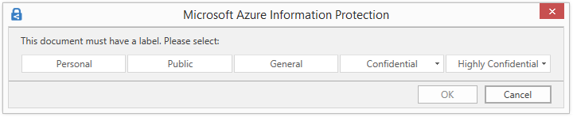

# Konfigurieren der Richtlinieneinstellungen für Azure Information Protection

>***Gilt für**: [Azure Information Protection](https://azure.microsoft.com/pricing/details/information-protection)*
>
>***Relevant für**: [Azure Information Protection klassischen Client für Windows](faqs.md#whats-the-difference-between-the-azure-information-protection-classic-and-unified-labeling-clients). Informationen zum Unified Label-Client finden Sie in der Microsoft 365-Dokumentation unter Informationen [zu Sensitivitäts Bezeichnungen](/microsoft-365/compliance/sensitivity-labels) . *

> [!NOTE] 
> Um eine einheitliche und optimierte Kundenfreundlichkeit zu gewährleisten, werden **Azure Information Protection klassische Client** -und Bezeichnungs **Verwaltung** im Azure- **Portal ab dem** **31. März 2021** eingestellt. Dieser Zeitrahmen ermöglicht allen aktuellen Azure Information Protection-Kunden den Umstieg auf die Microsoft Information Protection-Plattform für einheitliche Bezeichnungen. Weitere Informationen erhalten Sie im offiziellen [Hinweis zu veralteten Funktionen](https://aka.ms/aipclassicsunset).

Zusätzlich zum Titel und der QuickInfo für die Information Protection-Leiste gibt es einige Einstellungen in der Azure Information Protection-Richtlinie, die Sie unabhängig von den Bezeichnungen konfigurieren können:

Beachten Sie, dass Ihre Richtlinieneinstellungen möglicherweise unterschiedliche Standardwerte aufweisen, je nachdem, wann Sie Ihr Azure Information Protection-Abonnement erworben haben. Einige Einstellungen können auch durch eine [benutzerdefinierte Clienteinstellung](./rms-client/client-admin-guide-customizations.md) festgelegt werden.

## So konfigurieren Sie die Richtlinien Einstellungen

1. Öffnen Sie ein neues Browserfenster, und [melden Sie sich am Azure-Portal an](configure-policy.md#signing-in-to-the-azure-portal), falls Sie dies nicht bereits getan haben. Navigieren Sie anschließend zum Bereich **Azure Information Protection**.
    
    Geben Sie im Suchfeld für Ressourcen, Dienste und Dokumente zunächst **Information** ein, und klicken Sie dann auf **Azure Information Protection**.

2. Über die Menüoption **Klassifizierungen**  >  **Richtlinien** : Wählen Sie im Bereich **Azure Information Protection-Richtlinien** die Option **Global** aus, wenn die Einstellungen, die Sie konfigurieren möchten, für alle Benutzer gelten.
    
    Wenn sich die zu konfigurierenden Einstellungen in einer [bereichsbezogenen Richtlinie](configure-policy-scope.md) befinden, sodass sie nur für ausgewählte Benutzer verfügbar sind, wählen Sie stattdessen Ihre bereichsbezogene Richtlinie aus.

3. Konfigurieren Sie im Bereich **Richtlinie** die folgenden Einstellungen:
    
   - **Select the default label** (Standardbezeichnung auswählen): Wählen Sie bei Festlegung dieser Option die Bezeichnung aus, die Dokumenten und E-Mails zugewiesen werden sollen, die nicht über eine Bezeichnung verfügen. Bezeichnungen mit untergeordneten Bezeichnungen können nicht als Standardbezeichnungen festgelegt werden.
        
        Diese Einstellung gilt für Office-Apps und den Scanner. Sie gilt nicht für Datei-Explorer oder PowerShell.
    
    - Senden **von** Überwachungs **Daten an Azure Information Protection Analytics**: bevor Sie einen Azure Log Analytics-Arbeitsbereich für [Azure Information Analytics](reports-aip.md)erstellen, werden die Werte für diese Einstellung deaktiviert und **nicht konfiguriert**. Wenn Sie den Arbeitsbereich erstellen, ändern sich die Werte auf **Aus** und **Ein**.
        
        Wenn die Einstellung **auf on** festgelegt ist, senden Clients, die Central Reporting unterstützen, Daten an den Azure Information Protection-Dienst. Diese Informationen umfassen, welche Bezeichnungen angewendet werden und wann ein Benutzer eine Bezeichnung mit einer niedrigeren Klassifizierung auswählt oder eine Bezeichnung entfernt. Weitere Informationen zu den gesendeten und gespeicherten Informationen finden Sie im Abschnitt [Informationen zu den gesammelten und an Microsoft gesendeten](reports-aip.md#information-collected-and-sent-to-microsoft) Informationen in der Dokumentation zu Central Reporting. Legen Sie diese Richtlinien Einstellung auf **Off** fest, um zu verhindern, dass diese Daten gesendet werden.
    
    - **All documents and emails must have a label** (Alle Dokumente und E-Mails müssen eine Bezeichnung aufweisen): Bei Festlegung dieser Option auf **On** (Ein) muss auf alle gespeicherten Dokumente und gesendeten E-Mails eine Bezeichnung angewendet werden. Die Bezeichnung kann manuell von einem Benutzer, automatisch als Ergebnis einer erfüllten [Bedingung](configure-policy-classification.md) oder standardmäßig (durch Festlegung der Option **Select the default label** [Standardbezeichnung auswählen]) zugewiesen werden.
        
       Wenn beim Speichern eines Dokuments oder beim Senden einer E-Mail keine Bezeichnung zugewiesen ist, wird der Benutzer zur Auswahl einer Bezeichnung aufgefordert. Zum Beispiel:
        
       
        
       Diese Option gilt nicht, wenn Sie eine Bezeichnung mit dem PowerShell-Cmdlet [Set-AIPFileLabel](/powershell/module/azureinformationprotection/set-aipfilelabel) mit dem Parameter *RemoveLabel* entfernen.
        
   - **Benutzer müssen eine Begründung angeben, wenn sie eine niedrigere Klassifizierungsbezeichnung verwenden, eine Bezeichnung entfernen oder den Schutz entfernen möchten**: Ist diese Option auf **On** (Ein) festgelegt und der Benutzer führt eine dieser Aktionen aus (z.B. Ändern der Bezeichnung von **Public** (Öffentlich) auf **Personal** (Persönlich)), so wird er aufgefordert, eine Begründung für diese Aktion anzugeben. Der Benutzer kann z. B. angeben, dass das Dokument keine sensiblen Informationen mehr enthält. Die Aktion und der Grund für die Begründung werden im lokalen Windows-Ereignisprotokoll protokolliert: **Anwendungs-und Dienst Protokolle**  >  **Azure Information Protection**.  
        
       
        
       Diese Option gilt nicht für die Senkung der Klassifizierung untergeordneter Bezeichnungen unter der gleichen übergeordneten Bezeichnung.
        
   - **Wenden Sie für E-Mail-Nachrichten mit Anlagen eine Bezeichnung an, die der höchsten Einstufung dieser Anlagen entspricht**: Wenn Sie diese Option auf **Recommended** (Empfohlen) festlegen, werden Benutzer aufgefordert, ihrer E-Mail-Nachricht eine Bezeichnung zuzuweisen. Die Bezeichnung wird dynamisch ausgewählt, basierend auf den Klassifizierungsbezeichnungen, die auf die Anlagen angewendet werden, und es wird die höchste Klassifizierungsbezeichnung ausgewählt. Die Anlage muss eine physische Datei und kein Link zu einer Datei sein (z. b. ein Link zu einer Datei in Microsoft SharePoint oder onedrive). Benutzer können die Empfehlung akzeptieren oder ablehnen. Wenn Sie diese Option auf **Automatisch** festlegen, wird die Bezeichnung automatisch angewendet, aber Benutzer können die Bezeichnung entfernen oder vor dem Senden der E-Mail eine andere Bezeichnung auswählen.
        
        Um die Reihenfolge der untergeordneten Bezeichnungen bei der Verwendung dieser Richtlinieneinstellung zu berücksichtigen, müssen Sie [eine erweiterte Clienteinstellung konfigurieren](./rms-client/client-admin-guide-customizations.md#enable-order-support-for-sublabels-on-attachments).
        
        Wenn die Anlage mit der höchsten Klassifizierungs Bezeichnung für den Schutz mit der Vorschau Einstellung benutzerdefinierter Berechtigungen konfiguriert ist: Wenn die benutzerdefinierten Berechtigungen der Bezeichnung Outlook (nicht weiterleiten) einschließen, wird diese Bezeichnung angewendet, und der Schutz wird nicht weiterleiten auf die e-Mail angewendet. Wenn die benutzerdefinierten Berechtigungen der Bezeichnung nur für Word, Excel, PowerPoint und den Dateiexplorer gelten, wird diese Bezeichnung nicht auf die E-Mail angewendet, der Schutz ebenfalls nicht.
    
   - **Display the Information Protection bar in Office apps** (Information Protection-Leiste in Office-Apps anzeigen): Wenn diese Einstellung deaktiviert ist, können Benutzer keine Bezeichnungen aus einer Leiste in Word, Excel, PowerPoint und Outlook auswählen. Stattdessen müssen sie Bezeichnungen über die Schaltfläche **Schützen** auf dem Menüband auswählen. Wenn diese Einstellung aktiviert ist, können Benutzer Bezeichnungen entweder über die Leiste oder die Schaltfläche auswählen.
        
       Wenn diese Einstellung aktiviert ist, kann Sie in Verbindung mit einer erweiterten Clienteinstellung verwendet werden, sodass Benutzer [die Azure Information Protection-Leiste dauerhaft ausblenden können](./rms-client/client-admin-guide-customizations.md#permanently-hide-the-azure-information-protection-bar), wenn Sie diese nicht anzeigen möchten. Hierzu können Sie die Option **Leiste anzeigen** auf der Schaltfläche **schützen** löschen.
    
   - **Add the Do Not Forward button to the Outlook ribbon** (Die Schaltfläche „Nicht weiterleiten“ dem Outlook-Menüband hinzufügen): Wenn diese Einstellung aktiviert ist, können Benutzer diese Schaltfläche aus der **Schutzgruppe** auf dem Outlook-Menüband zusätzlich zur Auswahl der Option **Nicht weiterleiten** im Outlook-Menü auswählen. Um sicherzustellen, dass Benutzer Ihre e-Mails klassifizieren und schützen, empfiehlt es sich, diese Schaltfläche nicht hinzuzufügen, sondern stattdessen [eine Bezeichnung für den Schutz](configure-policy-protection.md) und eine benutzerdefinierte Berechtigung für Outlook zu konfigurieren. Wenn Sie diese Schutzeinstellung verwenden, geschieht das gleiche wie beim Klick auf **Nicht weiterleiten**. Wenn jedoch die Funktion in einer Bezeichnung enthalten ist, werden E-Mails ebenso als geschützt klassifiziert.
    
       Diese Schutzeinstellung kann auch mit einer erweiterten Clienteinstellung als [Clientanpassung](./rms-client/client-admin-guide-customizations.md#hide-or-show-the-do-not-forward-button-in-outlook) konfiguriert werden.
    
   - **Make the custom permissions option available to users** (Die Option der benutzerdefinierten Berechtigungen Benutzern zur Verfügung stellen): Wenn diese Einstellung aktiviert ist, können Benutzer ihre eigenen Schutzeinstellungen festlegen und jene außer Kraft setzen, die Sie möglicherweise in einer Bezeichnungskonfiguration eingeschlossen haben. Benutzer können außerdem eine Option zum Entfernen des Schutzes sehen. Wenn diese Einstellung deaktiviert ist, sehen Benutzer keine dieser Optionen.
        
       Beachten Sie, dass diese Richtlinieneinstellung keine Auswirkungen auf benutzerdefinierte Berechtigungen hat, die Benutzer über Office-Menüoptionen konfigurieren können. Sie kann jedoch auch mit einer erweiterten Clienteinstellung als [Clientanpassung](./rms-client/client-admin-guide-customizations.md#make-the-custom-permissions-options-available-or-unavailable-to-users) konfiguriert werden.
        
       Die benutzerdefinierten Berechtigungsoptionen befinden sich hier:
        
       - In Office-Anwendungen: Auf dem Menüband, Registerkarte **Start** > Gruppe **Schutz** > **Schützen** > **Benutzerdefinierte Berechtigungen**
        
       - Im Datei-Explorer: Klicken Sie mit der rechten Maustaste > **klassifizieren und schützen**  >  **benutzerdefinierter Berechtigungen**
    
   - **Geben Sie eine benutzerdefinierte URL für die „Weitere Infos“-Webseite des Azure Information Protection-Clients an**: Benutzer sehen diesen Link im Dialogfeld **Microsoft Azure Information Protection** im Abschnitt **Hilfe und Feedback**, wenn sie in ihren Office-Clientanwendungen auf der Registerkarte **Startseite** die Option **Schützen** > **Hilfe und Feedback** auswählen. Standardmäßig gelangen Sie über diesen Link zur [Azure Information Protection](https://www.microsoft.com/cloud-platform/azure-information-protection)-Website. Sie können eine HTTP- oder HTTPS-URL (empfohlen) eingeben, wenn dieser Link auf eine andere Webseite verweisen soll. Es wird nicht überprüft, ob die eingegebene benutzerdefinierte URL erreichbar ist oder auf allen Geräten ordnungsgemäß angezeigt wird.
        
       Beispielsweise können Sie für Ihren Helpdesk die Microsoft-Dokumentationsseite eingeben, die Informationen zum Installieren und Verwenden des-Clients enthält: `https://docs.microsoft.com/information-protection/rms-client/info-protect-client` . Oder Versionsinformationen zur Version: `https://docs.microsoft.com/information-protection/rms-client/client-version-release-history` . Alternativ können Sie eine eigene Webseite veröffentlichen, die Benutzern Informationen zur Kontaktaufnahme mit Ihrem Helpdesk bereitstellt oder ein Video enthält, das Benutzern zeigt, wie die konfigurierten Bezeichnungen verwendet werden.

4. Klicken Sie auf **Speichern**, um Ihre Änderungen zu speichern und diese für Benutzer verfügbar zu machen.

Nachdem Sie auf **Speichern** geklickt haben, sind Ihre vorgenommenen Änderungen automatisch für Benutzer und Dienste verfügbar. Es gibt keine gesonderte Veröffentlichungsoption mehr.

## Nächste Schritte

Um anzuzeigen, wie einige dieser Richtlinieneinstellungen zusammen funktionieren, absolvieren Sie das [Tutorial: Konfigurieren von Azure Information Protection-Richtlinieneinstellungen, die nahtlos funktionieren](infoprotect-settings-tutorial.md).

Um weitere Informationen zum Konfigurieren Ihrer Azure Information Protection-Richtlinie zu erhalten, klicken Sie auf die Links im Abschnitt [Konfigurieren der Richtlinie für Ihre Organisation](configure-policy.md#configuring-your-organizations-policy).