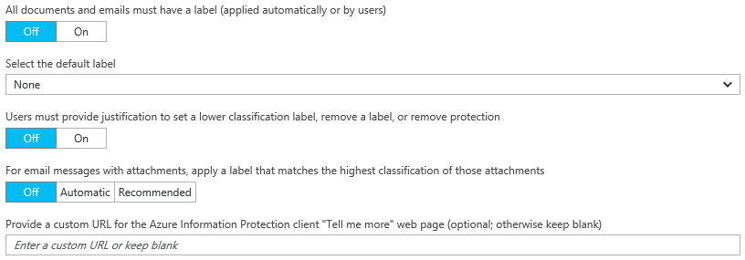

# Konfigurieren der Richtlinieneinstellungen für Azure Information Protection

>*Gilt für: Azure Information Protection*

Zusätzlich zum Titel und der QuickInfo für die Information Protection-Leiste gibt es einige Einstellungen in der Azure Information Protection-Richtlinie, die für alle Benutzer und alle Geräte gelten:

So konfigurieren Sie diese Einstellungen:

1. Sofern nicht bereits geschehen, melden Sie sich in einem neuen Browserfenster als globaler Administrator beim [Azure-Portal](https://portal.azure.com) an, und navigieren Sie zum Blatt **Azure Information Protection**. 
    
    Klicken Sie z.B. im Hubmenü auf **Weitere Dienste**, und geben Sie im Filterfeld den Begriff **Information** ein. Wählen Sie **Azure Information Protection** aus.

2. Wenn die Einstellungen, die Sie konfigurieren möchten, für alle Benutzer gelten sollen, konfigurieren Sie die folgenden globalen Einstellungen auf dem Blatt **Policy: Global** (Richtlinie: Global):

    - **All documents and emails must have a label** (Alle Dokumente und E-Mails müssen eine Bezeichnung aufweisen): Bei Festlegung dieser Option auf **On** (Ein) muss auf alle gespeicherten Dokumente und gesendeten E-Mails eine Bezeichnung angewendet werden. Die Bezeichnung kann manuell von einem Benutzer, automatisch als Ergebnis einer erfüllten [Bedingung](configure-policy-classification.md) oder standardmäßig (durch Festlegung der Option **Select the default label** [Standardbezeichnung auswählen]) zugewiesen werden. 

    Wenn beim Speichern eines Dokuments oder beim Senden einer E-Mail keine Bezeichnung zugewiesen wird, wird der Benutzer zur Auswahl einer Bezeichnung aufgefordert. Beispiel:

    

    - **Select the default label** (Standardbezeichnung auswählen): Wählen Sie bei Festlegung dieser Option die Bezeichnung aus, die Dokumenten und E-Mails zugewiesen werden sollen, die nicht über eine Bezeichnung verfügen. Bezeichnungen mit untergeordneten Bezeichnungen können nicht als Standardbezeichnungen festgelegt werden. 

    - **Benutzer müssen eine Begründung angeben, wenn sie eine niedrigere Klassifizierungsbezeichnung verwenden, eine Bezeichnung entfernen oder den Schutz entfernen möchten**: Ist diese Option auf **On** (Ein) festgelegt und der Benutzer führt eine dieser Aktionen aus (z.B. Ändern der Bezeichnung von **Public** (Öffentlich) auf **Personal** (Persönlich)), so wird er aufgefordert, eine Begründung für diese Aktion anzugeben. Der Benutzer kann z. B. angeben, dass das Dokument keine sensiblen Informationen mehr enthält. Die Aktion und die Begründung werden im lokalen Windows-Ereignisprotokoll des Benutzers protokolliert: **Anwendung** > **Microsoft Azure Information Protection**.  

    

    Diese Option gilt nicht für untergeordnete Bezeichnungen.

    - **Wenden Sie für E-Mail-Nachrichten mit Anlagen eine Bezeichnung an, die der höchsten Einstufung dieser Anlagen entspricht**: Wenn Sie diese Option auf **Recommended** (Empfohlen) festlegen, werden Benutzer aufgefordert, ihrer E-Mail-Nachricht eine Bezeichnung zuzuweisen. Die Bezeichnung wird dynamisch ausgewählt, basierend auf den Klassifizierungsbezeichnungen, die auf die Anlagen angewendet werden, und es wird die höchste Klassifizierungsbezeichnung ausgewählt. Benutzer können die Empfehlung akzeptieren oder ablehnen. Wenn Sie diese Option auf **On** (Ein) festlegen, wird die Bezeichnung automatisch angewendet, aber Benutzer können die Bezeichnung entfernen oder vor dem Senden der E-Mail eine andere Bezeichnung auswählen.  

    - **Geben Sie eine benutzerdefinierte URL für die „Weitere Infos“-Webseite des Azure Information Protection-Clients an**: Benutzer sehen diesen Link im Dialogfeld **Microsoft Azure Information Protection** im Abschnitt **Hilfe und Feedback** Abschnitt, wenn sie in ihren Office-Clientanwendungen auf der Registerkarte **Startseite** die Option **Schützen** > **Hilfe und Feedback** auswählen. Standardmäßig gelangen Sie über diesen Link zur [Azure Information Protection](https://www.microsoft.com/en-us/cloud-platform/azure-information-protection)-Website. Sie können eine HTTP- oder HTTPS-URL (empfohlen) eingeben, wenn dieser Link auf eine andere Webseite verweisen soll. Es wird nicht überprüft, ob die eingegebene benutzerdefinierte URL erreichbar ist oder auf allen Geräten ordnungsgemäß angezeigt wird.
        
        Sie könnten beispielsweise für Ihr Helpdesk die Seite der Microsoft-Dokumentation eingeben, die Informationen zum Installieren und Verwenden des Clients enthält (**https://docs.microsoft.com/information-protection/rms-client/info-protect-client**) oder Informationen zur Version (**https://docs.microsoft.com/information-protection/rms-client/client-version-release-history**). Alternativ können Sie eine eigene Webseite veröffentlichen, die Benutzern Informationen zur Kontaktaufnahme mit Ihrem Helpdesk bereitstellt oder ein Video enthält, das Benutzern zeigt, wie die konfigurierten Bezeichnungen verwendet werden.
        
     Diese Einstellungen können für bestimmte Benutzer überschrieben werden, wenn Sie eine [bereichsbezogene Richtlinie](configure-policy-scope.md) erstellt haben. Um diese Einstellungen in einer bereichsbezogenen Richtlinie zu konfigurieren, wählen Sie zuerst die bereichsbezogene Richtlinie auf dem ersten Blatt **Azure Information Protection** aus.

3. Klicken Sie auf **Save** (Speichern), um Ihre Änderungen zu speichern.

4. Klicken Sie auf dem anfänglichen Blatt **Azure Information Protection** auf **Publish** (Veröffentlichen), um Ihre Änderungen für die Benutzer verfügbar zu machen.

## Nächste Schritte

Um weitere Informationen zum Konfigurieren Ihrer Azure Information Protection-Richtlinie zu erhalten, klicken Sie auf die Links im Abschnitt [Konfigurieren der Richtlinie für Ihre Organisation](configure-policy.md#configuring-your-organizations-policy).  

[!INCLUDE[Commenting house rules](../includes/houserules.md)]
