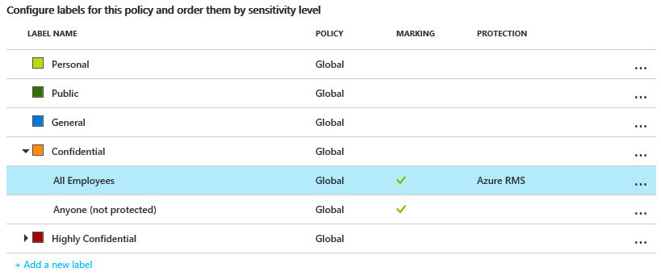

# Schritt 2: Konfigurieren der Azure Information Protection-Richtlinie

>*Gilt für: [Azure Information Protection](https://azure.microsoft.com/pricing/details/information-protection)*

Obwohl Azure Information Protection eine Standardrichtlinie enthält, die Sie ohne Konfiguration verwenden können, werden wir einen Blick auf die Richtlinie werfen und einige Änderungen vornehmen.

1. Klicken Sie nach [Schritt 1](infoprotect-tutorial-step1.md) im Azure-Portal auf **Klassifizierungen** > **Richtlinien** > **Global**, um das Blatt **Richtlinie: Global** zu öffnen. Auf diesem Blatt wird die Azure Information Protection-Standardrichtlinie angezeigt, die für Ihren Mandanten erstellt wurde.

2. Nehmen Sie sich ein paar Minuten Zeit, um sich mit den angezeigten Bezeichnungen vertraut zu machen:
    
    - Bezeichnungen für die Klassifizierung: **Personal** (Persönlich), **Public** (Öffentlich), **General** (Allgemein), **Confidential** (Vertraulich) und **Highly Confidential** (Streng vertraulich). Die beiden letzten Bezeichnungen können erweitert werden, um untergeordnete Bezeichnungen anzuzeigen, die Beispiele für eine Klassifizierung mit Unterkategorien bereitstellen:
    
       > [!NOTE]
       > Die Standardrichtlinie kann etwas anders aussehen als in diesem Tutorial. Zum Beispiel kann eine Bezeichnung **Internal** (Intern) heißen anstatt **General** (Allgemein) und **Secret** (Geheim) anstatt **Highly Confidential** (Streng vertraulich). Möglicherweise verfügen Sie nicht über die untergeordneten Bezeichnungen namens **Nur Empfänger**, oder Sie verfügen über gar keine Bezeichnungen. Der Grund für diese Änderungen ist, dass es unterschiedliche Versionen der Standardrichtlinie gibt, je nachdem wann sie für Ihren Mandanten erstellt wurde. Oder Sie haben sie möglicherweise vor dem Start des Tutorials selbst bearbeitet.
       > 
       > Wenn die Standardrichtlinie anders aussieht, können Sie dieses Tutorial dennoch verwenden, sollten sich dieser Änderungen aber bei den folgenden Anweisungen und Abbildungen bewusst sein. Wenn Sie die Standardrichtlinie ändern möchten, damit sie der aktuellen Standardrichtlinie entspricht, finden Sie dazu Informationen unter [Die Azure Information Protection-Standardrichtlinie](../deploy-use/configure-policy-default.md).
    
    - In der Standardkonfiguration verfügen einige Bezeichnungen nicht über optische Kennzeichnungen. Die optischen Kennzeichnungen sind eine Fußzeile, ein Header und ein Wasserzeichen. Je nach Ihrer Standardrichtlinie ist für einige Bezeichnungen auch ein Schutz festgelegt. Beispiel: 
    
    
    
3. Es werden auch einige Richtlinieneinstellungen angezeigt. Zum Beispiel ist keine Standardbezeichnung festgelegt, Dokumente und E-Mails müssen keine Bezeichnungen aufweisen, und Benutzer müssen keine Begründung angeben, wenn sie Bezeichnungen ändern:
    
    

## Ändern der Einstellungen für eine Standardbezeichnung und Aufforderung zur Eingabe einer Begründung

Für unser Tutorial ändern wir einige dieser Richtlinieneinstellungen, damit Sie sehen, wie diese funktionieren:

1. Legen Sie **Standardbezeichnung auswählen** auf **Allgemein** fest. 

    Wenn Sie nicht über diese Bezeichnung verfügen, da Sie eine ältere Version der Richtlinie verwenden, wählen Sie **Internal** (Intern) als entsprechende Bezeichnung.

2. Legen Sie die Option **Benutzer müssen eine Begründung angeben, wenn sie eine niedrigere Klassifizierung festlegen, eine Kennzeichnung oder den Schutz entfernen möchten** auf **Ein** fest.

3. Suchen Sie außerdem die Einstellung **Die Option „benutzerdefinierte Berechtigungen“ für Benutzer verfügbar machen**. Wenn sie auf **Aus** festgelegt ist, ändern Sie die Einstellung auf **Ein**.
    
    Möglicherweise müssen Sie diese Einstellung nicht ändern, da die Standardeinstellung davon abhängt, wann Sie Ihr Abonnement erhalten haben. Wir werden später in diesem Tutorial benutzerdefinierte Berechtigungen verwenden, um ein geschütztes Dokument mit einem Benutzer zu teilen, den Sie durch Klicken auf die Datei mit der rechten Maustaste im Datei-Explorer angeben.

## Erstellen einer neuen Bezeichnung für Schutz, optische Kennzeichnungen und einer Bedingung für die Aufforderung zur Eingabe einer Klassifizierung.

Wir erstellen nun eine neue untergeordnete Bezeichnung für **Vertraulich**.

1. Klicken Sie mit der rechten Maustaste auf die Bezeichnung **Vertraulich**, und klicken Sie auf **Unterbezeichnung hinzufügen**.
    
    Wenn Sie nicht über eine Bezeichnung namens **Vertraulich** verfügen, können Sie eine andere Bezeichnung auswählen oder stattdessen eine neue Bezeichnung erstellen und das Tutorial mit geringfügigen Unterschieden weiterhin befolgen.

2. Geben Sie auf dem Blatt **Untergeordnete Bezeichnung** den Bezeichnungsnamen von **Finanzen** an, und fügen Sie folgende Beschreibung hinzu: **Vertrauliche Daten, die finanzielle Informationen enthalten, die nur auf Mitarbeiter beschränkt sind**.
    
    In diesem Text wird beschrieben, wie die ausgewählte Bezeichnung verwendet werden soll; er wird Benutzern als QuickInfo angezeigt, um ihnen bei der Auswahl der Bezeichnung zu helfen.

3. Wählen Sie unter **Berechtigungen für Dokumente und E-Mails mit dieser Bezeichnung festlegen** die Optionen **Schützen** und dann **Schutz** aus:
    
     
    
4. Stellen Sie sicher, dass auf dem Blatt **Schutz** die Option **Azure (cloud key)** (Azure (Cloud-Schlüssel)) ausgewählt ist. Diese Option verwendet den Azure Rights Management-Dienst zum Schützen von Dokumenten und E-Mails. Stellen Sie sicher, dass **Berechtigungen festlegen** ebenfalls ausgewählt ist. Klicken Sie dann auf **Berechtigungen hinzufügen**.

5. Klicken Sie auf dem Blatt **Berechtigungen hinzufügen** auf **Hinzufügen\<Organisationsname> – Alle Mitglieder**. Wenn Ihr Organisationsname z.B. VanArsdel Ltd ist, wird Ihnen die folgende Auswahloption angezeigt:
    
     
    
    Diese Option wählt automatisch alle Benutzer in Ihrer Organisation aus, denen Berechtigungen erteilt werden können. Sie können jedoch an den anderen Optionen erkennen, dass Sie Ihren Mandanten auch nach Gruppen oder Benutzern durchsuchen können. Wenn Sie die Option **Details eingeben** anklicken, können Sie auch einzelne E-Mail-Adressen oder sogar alle Benutzer einer anderen Organisation angeben.

6. Wählen Sie für die Berechtigungen **Prüfer** aus den vordefinierten Optionen aus. Ihnen wird angezeigt, dass diese Berechtigungsebene automatisch manche der aufgelisteten Berechtigungen erteilt, aber nicht alle:
    
    
    
    Sie können unterschiedliche Berechtigungsstufen auswählen oder einzelne Nutzungsrechte mithilfe der Option **Benutzerdefiniert** angeben. Behalten Sie jedoch für dieses Tutorial die Option **Prüfer** bei. Sie können später mit unterschiedlichen Berechtigungen experimentieren und sich einlesen, wie diese das Verwenden der geschützten Dokumente oder E-Mails durch die angegebenen Benutzer einschränken können.

7. Klicken Sie auf **OK**, um das Blatt **Berechtigungen hinzufügen** zu schließen und Ihnen wird angezeigt, wie das Blatt **Schutz** entsprechend Ihrer Konfiguration aktualisiert wird. Beispiel:
    
     
    
    Wenn Sie auf **Berechtigungen hinzufügen** klicken, wird das Blatt **Berechtigungen hinzufügen** erneut geöffnet, sodass Sie weitere Benutzer hinzufügen und diesen unterschiedliche Berechtigungen erteilen können. Sie können einer bestimmten Gruppe beispielsweise nur eine Anzeigeberechtigung erteilen. In diesem Tutorial bleiben wir jedoch bei einem Berechtigungssatz für alle Benutzer.

8. Überprüfen Sie die Standards für den Inhaltsablauf und den Offlinezugriff, und behalten Sie diese bei. Klicken Sie dann auf **OK**, um das Blatt **Schutz** zu speichern und zu schließen.

8. Kehren Sie zum Blatt **Untergeordnete Bezeichnung**, und suchen Sie den Abschnitt **Optische Kennzeichnung festlegen**:
    
    Klicken Sie für die Einstellung **Dokumente mit dieser Bezeichnung besitzen eine Fußzeile** auf **Ein**, und geben Sie dann **Als vertraulich klassifiziert** im **Textfeld** ein. 
    
    Klicken Sie für die Einstellung **Documents with this label have a watermark** (Dokumente mit dieser Bezeichnung haben ein Wasserzeichen) auf **Ein**, und geben Sie dann im **Textfeld** den Namen Ihrer Organisation ein. In diesem Beispiel lautet er **VanArsdel, Ltd** 
    
    Sie können die Darstellung für diese optischen Kennzeichnungen zwar ändern, wir behalten jedoch hier die Standardwerte bei.
    
9. Suchen Sie den Abschnitt **Configure conditions for automatically applying this label** (Bedingungen konfigurieren, um diese Bezeichnung automatisch anzuwenden):
    
    Klicken Sie auf **Neue Bedingung hinzufügen**, und wählen Sie anschließend auf dem Blatt **Bedingung** Folgendes aus:
    
    ein. **Choose the type of condition:** (Bedingungstyp auswählen) Behalten Sie den Standardwert **Informationstypen** bei.
    
    b. Im Suchfeld **Informationstypen auswählen**: Tippen Sie **Kreditkartennummer** ein, Und wählen Sie dann in den Suchergebnissen **Kreditkartennummer** aus.
    
    c. **Minimum number of occurrences:** (Mindestanzahl der Vorkommen) Behalten Sie den Standardwert **1** bei.
    
    d. **Count occurrences with unique values only:** (Nur Vorkommen mit eindeutigen Werten zählen) Behalten Sie den Standardwert **Aus** bei.
    
    
    
    Klicken Sie auf **Save** (Speichern), um wieder auf das Blatt **Untergeordnete Bezeichnung** zurückzukehren.

10. Auf dem Blatt **Untergeordnete Bezeichnung** können Sie sehen, dass **Kreditkartennummer** als **BEDINGUNGSNAME** angezeigt wird, mit **1** **VORKOMMEN**:
    
    

11. Behalten Sie für **Select how this label is applied** (Anwendungsweise dieser Bezeichnung auswählen) den Standardwert **Empfohlen** bei, und ändern Sie den Tipp für die Standardrichtlinie nicht. 

12. Geben Sie im Textfeld **Enter notes for internal housekeeping** (Notizen für interne Haushaltsführung eingeben) **For testing purposes only** (Ausschließlich für Testzwecke) ein.

13. Klicken Sie auf dem Blatt **Untergeordnete Bezeichnung** auf **Speichern**. Klicken Sie dann auf dem Blatt **Policy: Global** (Richtlinie: Global) erneut auf **Speichern**.
    
    Ihnen wird nun Ihre neue untergeordnete Bezeichnung angezeigt, die für optische Kennzeichnungen und den Schutz konfiguriert ist. Beispiel:

    
    
    Sie sehen auch, dass die Einstellungen mit Ihren Änderungen für die Standardbezeichnung und mit Ihrer Begründung konfiguriert werden:
    
    
    
Nachdem Sie dieses Tutorial abgeschlossen haben, können Sie das Azure-Portal entweder schließen oder es offen lassen, um zusätzliche Konfigurationsoptionen auszuprobieren.

Da Sie jetzt die Standardrichtlinie kennen und einige Änderungen daran vorgenommen haben, lernen Sie im nächsten Schritt, den Azure Information Protection-Client zu installieren.

|Weitere Informationen zu|Zusätzliche Informationen|
|--------------------------------|--------------------------|
|Über die Standardrichtlinie und verschiedene Versionen|[Die Azure Information Protection-Standardrichtlinie](../deploy-use/configure-policy-default.md)|
|Informationen zum Konfigurieren der Richtlinie|[Konfigurieren der Azure Information Protection-Richtlinie](../deploy-use/configure-policy.md)|
|Detaillierte Anweisungen zum Konfigurieren einer Bezeichnung für den Schutz|[How to configure a label for Rights Management protection (Konfigurieren einer Bezeichnung für Rights Management-Schutz)](../deploy-use/configure-policy-protection.md)|
|Detaillierte Informationen über die Berechtigungen|[Configuring usage rights for Azure Rights Management (Konfigurieren von Nutzungsrechten für Azure Rights Management)](../deploy-use/configure-usage-rights.md)|

>[!div class="step-by-step"]
[&#171; Schritt 1](infoprotect-tutorial-step1.md)
[Schritt 3 &#187;](infoprotect-tutorial-step3.md)

[!INCLUDE[Commenting house rules](../includes/houserules.md)]