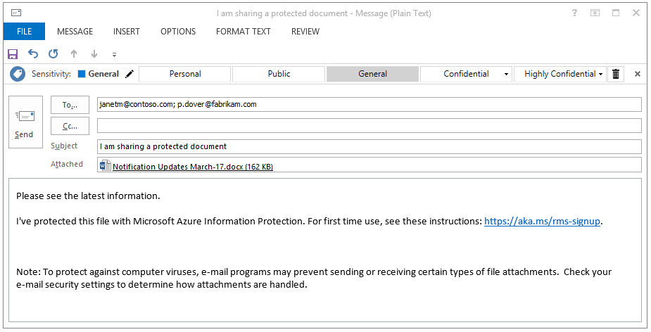

# Schritt 5: Freigeben geschützter Dateien in Aktion und Nachverfolgen des Dokuments 

>*Gilt für: [Azure Information Protection](https://azure.microsoft.com/pricing/details/information-protection)*

Verwenden Sie für diesen letzten Schritt des Tutorials ein Word-Dokument oder ein Excel-Arbeitsblatt, das Sie bereits erstellt haben und an einen Partner oder Kollegen senden möchten. In diesem Tutorial spielt der enthaltene Text keine Rolle. Etwas Text ist jedoch sinnvoll, damit Sie einfacher überprüfen können, ob der Inhalt vom autorisierten Empfänger gelesen werden kann.

Anschließend können Sie das Dokument sicher per E-Mail freigeben. 

## So geben Sie Ihr Dokument sicher per E-Mail frei

1. Klicken Sie im Datei-Explorer mit der rechten Maustaste auf das Dokument, und wählen Sie **Klassifizieren und schützen** aus. Das Dialogfeld **Klassifizieren und schützen – Azure Information Protection** wird geöffnet:

    

2. Wählen Sie **Protect with custom permissions** (Mit benutzerdefinierten Berechtigungen schützen) aus, wodurch zusätzliche Optionen angezeigt werden.

3. Verwenden Sie für **Select permissions** (Berechtigungen auswählen) die Standardeinstellung **Viewer – View only** (Viewer – Nur anzeigen).

    Mit dieser Einstellung können die Empfänger das Dokument anzeigen, jedoch nicht bearbeiten oder ausdrucken.

4. Geben Sie für **Select users** (Benutzer auswählen) eine oder mehrere geschäftliche E-Mail-Adressen ein, wie beim Senden eines Dokuments an einen Geschäftspartner Ihrer Organisation. Um mehr als eine Adresse anzugeben, verwenden Sie ein Semikolon, oder drücken Sie die EINGABETASTE. 

    Sie müssen eine geschäftliche E-Mail-Adresse wie **janetm@contoso.com** oder **p.dover@fabrikam.com** angeben, weil Azure Information Protection momentan keine privaten E-Mail-Adressen für dieses Szenario unterstützt. 

    Klicken Sie alternativ auf das Symbol **Select users, groups, or organization** (Benutzer, Gruppen oder Organisation auswählen), um die E-Mail-Adresse eines Kollegen auszuwählen:

      
    
    Nach der Angabe der Adressen kopieren Sie sie in die Zwischenablage, da sie in einem späteren Schritt verwendet werden.

5. Klicken Sie auf **Übernehmen** und warten Sie auf die Nachricht **Work finished** (Vorgang abgeschlossen), um die Ergebnisse zu sehen. Klicken Sie anschließend auf **Schließen**.

4. Zurück im Datei-Explorer klicken Sie mit der rechten Maustaste erneut auf die Datei und wählen dieses Mal **Senden an** > **E-Mail-Empfänger** aus. Durch diesen Vorgang wird Ihr Dokument an eine E-Mail mit Standardtext angehängt, der geändert wird.

5. Bevor der Standardtext geändert wird, fügen Sie die E-Mail-Adressen ein, die Sie zuvor im Feld **An** angegeben haben. 

6. Geben Sie optional Ihren Betreff in das Feld **Betreff** ein. Beispiel: **Ich gebe ein geschütztes Dokument frei**. 

7. Ändern Sie die Standardbeschreibung der Nachricht, damit sie für Ihre Empfänger geeignet ist. Fügen Sie jedoch den folgenden Text hinzu:

    **Ich habe diese Datei mit Microsoft Azure Information Protection geschützt. Wenn Ihnen diese Funktion zum ersten mal begegnet, finden Sie weitere Informationen unter: https://aka.ms/rms-signup.** 

    

    Klicken Sie auf **Senden**.

Nachdem Sie Ihr geschütztes Dokument nun gesendet haben, bitten Sie die Empfänger, das Dokument anzunehmen und zu öffnen. 

## Bitten Sie die Empfänger, das E-Mail-Dokument zu öffnen.

Die Empfänger können das als E-Mail-Anlage gesendete, geschützte Dokument auf verschiedenen Geräten lesen. Die Geräte umfassen iPads, iPhones, Android-Tablets und -Smartphones sowie Macintosh- und Windows-Computer.

Bitten Sie die Empfänger, die gesendete E-Mail zu lesen. In der Annahme, dass diese zum ersten Mal Anlagen erhalten haben, die durch Rights Management geschützt sind, bitten Sie sie, auf den Link für die Anweisungen zu klicken. Es wird dann die **Willkommensseite** für Microsoft Azure Information Protection angezeigt, die zur Eingabe der geschäftlichen E-Mail-Adresse auffordert.

Wenn sie auf **Registrieren** klicken, prüft Azure Information Protection, ob ihre Organisation über ein Abonnement verfügt, das den Azure Rights Management-Datenschutzdienst umfasst. Wenn dies nicht der Fall ist, können sie ein kostenloses Konto beantragen.

### Anweisungen für Empfänger: So zeigen Sie die Anlage mit dem geschützten Dokument an

1. Öffnen Sie die Anlage auf einem PC oder mobilen Gerät mit installiertem Office, um das Dokument zu lesen.  

2.  Wenn Sie zur Eingabe von Benutzernamen und Kennwort aufgefordert werden, geben Sie Ihren Benutzernamen im gleichen Format wie die E-Mail-Adresse ein, die Sie zum Senden der E-Mail und der Anlage verwendet haben. Beispiel: **janetm@contoso.com** oder **p.dover@fabrikam.com**. Geben Sie das Kennwort ein, das Sie beim Registrieren von RMS for Individuals erhalten haben. Wenn Ihre Organisation über einen Clouddienst wie Office 365 verfügt oder Azure verwendet, geben Sie Ihr übliches Arbeitskennwort ein.

3. Nach dem Öffnen können Sie den Inhalt des Dokuments lesen. Da der Inhalt schreibgeschützt ist, können Sie ihn nicht ändern.

Als optionalen Schritt kann der Empfänger die E-Mail an andere Personen weiterleiten, die Sie in der ursprünglichen E-Mail nicht angegeben haben. Diese Personen können die Anlage nicht öffnen. Bei der Aufforderung zur Eingabe des Benutzernamens wird den Empfängern der Zugriff verweigert.

Nachdem der Empfänger die Anlage geöffnet und optional an einen anderen Empfänger weitergeleitet hat, sind Sie bereit, Ihr Dokument nachzuverfolgen.

## So verfolgen Sie das geschützte Dokument

1.  Öffnen Sie das Dokument, das Sie geschützt und freigegeben haben. Das Informationsbanner bestätigt die benutzerdefinierten Schutzeinstellungen, die Sie angegeben haben:

    

2.  Klicken Sie auf der Registerkarte **Start** auf **Schützen** > **Nachverfolgen und widerrufen**:

    

    Dadurch gelangen Sie zu der Website für die Dokumentennachverfolgung.

2.  Wenn die Seite **Schutz und Freigabe nach Ihren Vorgaben** angezeigt wird, klicken Sie auf **Anmelden** und geben Benutzernamen und Kennwort erneut ein.

3.  Auf der Seite **Your shared documents** (Freigegebene Dokumente) wird der Name des freigegebenen Dokuments angezeigt. Zu diesem Zeitpunkt wird nur diese Datei angezeigt. Sobald Sie jedoch zusätzliche geschützte Dokumente freigeben, wird die Liste erweitert.

    Auf dieser Seite sehen Sie, wann Sie das Dokument freigegeben (d. h. die E-Mail mit dem geschützten Anhang versendet) haben, sowie das Datum der letzten Aktivität und den Namen des Empfängers der E-Mail. Klicken Sie auf den Dokumentnamen, um weitere Details zu sehen.

4.  Auf der neuen Seite, die den Namen der angeklickten Datei hat, sehen Sie spezifische Übersichtsdetails für das Dokument und eine Liste weiterer Optionen, die für das Dokument verfügbar sind (**Liste**, **Zeitskala**, **Karte**, **Einstellungen**).

    Klicken Sie auf die einzelnen Optionen, um verschiedene Möglichkeiten zum Verfolgen des geschützten Dokuments auszuprobieren. Sie können auf der Seite **Zusammenfassung** aber auch auf **In Excel öffnen** klicken, um die Informationen in eine Kalkulationstabelle zu exportieren, oder auf **Zugriff widerrufen** , um die Freigabe des Dokuments zu beenden.

Sie können zu dieser Website zurückkehren, um weitere Aktivitäten für das geschützte Dokument zu verfolgen oder um den Zugriff ggf. zu widerrufen. Sie können auch von Ihrem mobilen Gerät oder Tablet auf die Website zugreifen, indem Sie den Browserlink [Dokumentenverfolgung](http://go.microsoft.com/fwlink/?LinkId=529562)auswählen.

|Weitere Informationen zu|Zusätzliche Informationen|
|--------------------------------|--------------------------|
|Vollständige Anweisungen zum Schützen von Dateien, die dann sicher freigegeben werden können|[Klassifizieren und Schützen einer Datei oder E-Mail](../rms-client/client-classify-protect.md)|
|Informationen zum kostenlosen Konto, für das sich andere Benutzer registrieren können|[RMS for Individuals und Azure Rights Management](../understand-explore/rms-for-individuals.md)|
|Verwenden der Website zur Dokumentennachverfolgung|[Nachverfolgen und Widerrufen Ihrer Dokumente](../rms-client/client-track-revoke.md)

## Nächste Schritte

Nun, da Sie die standardmäßige Azure Information Protection-Richtlinie gesehen haben, und jetzt wissen, wie Sie sie anpassen können und wie das Bezeichnen in einem Word-Dokument funktioniert, testen Sie doch einige der anderen Einstellungen und lernen Sie die Funktionsweise der Office-Apps kennen, die Azure Information Protection verwenden: Excel, PowerPoint, Outlook. Falls diese Anwendungen geöffnet waren, als Sie den Azure Information Protection-Client installiert haben, schließen Sie sie, und öffnen Sie sie erneut, bevor Sie sie mit Azure Information Protection verwenden.

Geben Sie weitere Dokumente frei, und verfolgen Sie deren Verwendung. Testen Sie auch den Widerruf von Dokumenten.

Es empfiehlt sich zudem, im Azure-Portal zur Seite **Schnellstart** zurückzukehren und einige der [häufig gestellten Fragen](faqs.md) zu Azure Information Protection sowie einige andere Artikel der Dokumentation zu lesen. Wenn Sie mit der Bereitstellung von Azure Information Protection für Ihre Organisation beginnen möchten, sollte Ihre nächste Station die [Roadmap für die Bereitstellung von Azure Information Protection](../plan-design/deployment-roadmap.md) sein. 

[!INCLUDE[Commenting house rules](../includes/houserules.md)]