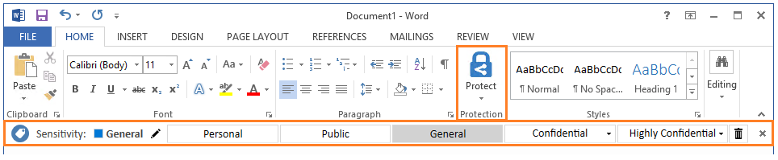
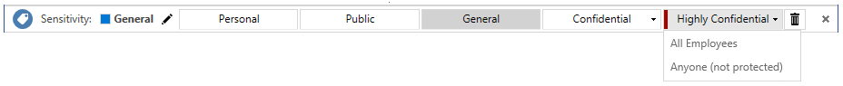

# Tutorial: Konfigurieren der Azure Information Protection-Richtlinieneinstellungen und Erstellen einer neuen Bezeichnung

>***Gilt für**: [Azure Information Protection](https://azure.microsoft.com/pricing/details/information-protection)*
>
>***Relevant für:** [Klassischer Azure Information Protection-Client für Windows](faqs.md#whats-the-difference-between-the-azure-information-protection-classic-and-unified-labeling-clients)*

>[!NOTE] 
> Der **klassische Azure Information Protection-Client** und die **Bezeichnungsverwaltung** im Azure-Portal werden am **31. März 2021** **eingestellt**, um eine vereinheitlichte und optimierte Kundenumgebung zu gewährleisten. Dieser Zeitrahmen ermöglicht allen aktuellen Azure Information Protection-Kunden den Umstieg auf die Microsoft Information Protection-Plattform für einheitliche Bezeichnungen. Weitere Informationen erhalten Sie im offiziellen [Hinweis zu veralteten Funktionen](https://aka.ms/aipclassicsunset).
>
> **Zum Bereitstellen des klassischen AIP-Clients** öffnen Sie ein Supportticket, um Zugriff auf den Download zu erhalten.

> [!TIP]
> Wenn Sie einen anderen Bezeichnungsclient als den klassischen Client verwenden, finden Sie entsprechende Anweisungen für dieses Tutorial in der [Dokumentation zur Microsoft 365-Compliance](/microsoft-365/compliance/sensitivity-labels).
> 

In diesem Tutorial wird Folgendes vermittelt:
> [!div class="checklist"]
> * Konfigurieren von Richtlinieneinstellungen
> * Erstellen einer neuen Bezeichnung 
> * Konfigurieren der Bezeichnung für optische Kennzeichnungen, empfohlene Klassifizierung und Schutz
> * Testen Ihrer Einstellungen und Bezeichnungen

Bei dieser Konfiguration sehen Benutzer, wie eine Standardbezeichnung angewendet wird, wenn sie ein neues Dokument erstellen oder eine neue E-Mail verfassen. Allerdings werden sie aufgefordert, die neue Bezeichnung anzuwenden, wenn Kreditkarteninformationen erkannt werden. Wenn die neue Bezeichnung angewendet wird, wird der Inhalt neu klassifiziert und durch eine entsprechende Fußzeile und ein Wasserzeichen geschützt. 

Für dieses Tutorial benötigen Sie etwa 15 Minuten.

## Voraussetzungen 

Voraussetzungen für dieses Tutorial:

1. Ein Abonnement, das Azure Information Protection-Plan 2 beinhaltet.
    
    Wenn Sie kein Abonnement besitzen, das Azure Information Protection-Plan 2 enthält, können Sie ein [kostenloses](https://admin.microsoft.com/Signup/Signup.aspx?OfferId=87dd2714-d452-48a0-a809-d2f58c4f68b7) Konto für Ihre Organisation erstellen.

2. Der Bereich „Azure Information Protection“ wurde zum Azure-Portal hinzugefügt, der Schutzdienst ist aktiviert, und Sie haben mindestens eine Bezeichnung in der globalen Azure Information Protection-Richtlinie veröffentlicht.
    
    Diese Schritte werden hier beschrieben: [Schnellstart: Hinzufügen von Azure Information Protection zum Azure-Portal und Anzeigen der Richtlinie](quickstart-viewpolicy.md).

3. Der auf Ihrem Windows-Computer installierte klassische Azure Information Protection-Client; mindestens Windows 7 mit Service Pack 1. 

4. Sie sind bei Office-Apps einer der folgenden Kategorien angemeldet:
    
    - Office-Apps für die in der [Tabelle der unterstützten Versionen für Microsoft 365-Apps nach Updatekanal](/officeupdates/update-history-microsoft365-apps-by-date) aufgeführten Versionen von Microsoft 365 Apps for Business oder Microsoft 365 Business Premium, wenn dem Benutzer eine Azure Rights Management-Lizenz (in Microsoft 365 auch „Azure Information Protection“ genannt) zugewiesen wurde.
    
    - Microsoft 365 Apps for Enterprise
    
    - Office Professional Plus 2019.
    
    - Office Professional Plus 2016.
    
    - Office Professional Plus 2013 mit Service Pack 1.
    
    - Office Professional Plus 2010 mit Service Pack 2.

> [!TIP]
> Die vollständige Liste der Voraussetzungen an Azure Information Protection finden Sie unter [Anforderungen für Azure Information Protection](requirements.md).
> 
Los geht’s! Fahren Sie mit [Bearbeiten der Azure Information Protection-Richtlinie – AIP](#edit-the-azure-information-protection-policy) fort.

## Bearbeiten der Azure Information Protection-Richtlinie

Über das Azure-Portal ändern Sie zuerst eine Reihe von Richtlinieneinstellungen und erstellen dann eine neue Bezeichnung.

### Bearbeiten der Richtlinieneinstellungen

1. Öffnen Sie ein neues Browserfenster, und melden Sie sich als globaler Administrator beim [Azure-Portal](https://portal.azure.com) an. Navigieren Sie anschließend zu **Azure Information Protection**. 
    
    Geben Sie im Suchfeld für Ressourcen, Dienste und Dokumente zunächst **Information** ein, und klicken Sie dann auf **Azure Information Protection**.
    
    Wenn Sie nicht der globale Administrator sind, verwenden Sie den folgenden Link für andere Rollen: [Anmelden beim Azure-Portal](configure-policy.md#signing-in-to-the-azure-portal)

2. Klicken Sie auf **Klassifizierungen** > **Richtlinien** > **Global**, um das Blatt **Richtlinie: Global** zu öffnen. 

3. Suchen Sie die Richtlinieneinstellungen nach den Bezeichnungen im Abschnitt **Einstellungen konfigurieren, die für Information Protection-Endbenutzer angezeigt und angewendet werden**. 
    
    Notieren Sie sich, wie die Einstellungen aktuell konfiguriert sind. Dies gilt insbesondere für die Einstellungen **Standardbezeichnung auswählen** und **Benutzer müssen eine Begründung angeben, wenn sie eine niedrigere Klassifizierung festlegen, eine Kennzeichnung oder den Schutz entfernen möchten**. Beispiel:
    
    
    
    Diese Richtlinieneinstellungen benötigen Sie später in diesem Tutorial, wenn Sie diese testen werden.

4. Wählen Sie unter **Standardbezeichnung auswählen** eine der Bezeichnungen aus, z. B. **Allgemein**. 
    
    Die Bezeichnung **Allgemein** ist eine der Standardbezeichnungen, die Azure Information Protection für Sie erstellen kann. Dieser Schritt wird im Abschnitt [Erstellen und Veröffentlichen von Bezeichnungen](quickstart-viewpolicy.md#create-and-publish-labels) der Schnellstartanleitung zum Hinzufügen von Azure Information Protection zum Azure-Portal behandelt.

5. Falls noch nicht geschehen, legen Sie die Option **Benutzer müssen eine Begründung angeben, wenn sie eine niedrigere Klassifizierung festlegen, eine Kennzeichnung oder den Schutz entfernen möchten** auf **Ein** fest.

6. Stellen Sie außerdem sicher, dass **Die Information Protection-Leiste in Office-Apps anzeigen** auf **Ein** festgelegt ist.

7. Wählen Sie **Speichern** auf diesem Blatt **Richtlinie: Global** aus, und klicken Sie auf **OK**, wenn Sie zum Bestätigen der Aktion aufgefordert werden. Schließen Sie diesen Bereich.

### Erstellen einer neuen Bezeichnung für Schutz, optische Kennzeichnungen und einer Bedingung für die Aufforderung zur Eingabe einer Klassifizierung.

Wir erstellen nun eine neue untergeordnete Bezeichnung für **Vertraulich**.

1. Über die Menüoptionen **Klassifizierungen** > **Bezeichnungen**: Klicken Sie mit der rechten Maustaste auf die Bezeichnung **Vertraulich**, und klicken Sie auf **Unterbezeichnung hinzufügen**.
    
    Wenn Sie nicht über eine Bezeichnung namens **Vertraulich** verfügen, können Sie eine andere Bezeichnung auswählen oder stattdessen eine neue Bezeichnung erstellen und das Tutorial mit geringfügigen Unterschieden weiterhin befolgen.

2. Geben Sie im Bereich **Untergeordnete Bezeichnung** den Bezeichnungsnamen **Finanzen** ein, und fügen Sie die folgende Beschreibung hinzu: **Vertrauliche Daten, die Finanzinformationen enthalten, die nur Mitarbeitern zugänglich sind**.
    
    In diesem Text wird beschrieben, wie die ausgewählte Bezeichnung verwendet werden soll; er wird Benutzern als QuickInfo angezeigt, um ihnen bei der Auswahl der Bezeichnung zu helfen.

3. Wählen Sie bei **Berechtigungen für Dokumente und E-Mails mit dieser Bezeichnung festlegen** die Option **Schützen** aus. Damit wird automatisch der Bereich **Schutz** geöffnet, indem die Option **Schutz** für Sie ausgewählt wird:
    
     
    
4. Stellen Sie sicher, dass im Bereich **Schutz** die Option **Azure (cloud key)** (Azure (Cloudschlüssel)) ausgewählt ist. Diese Option verwendet den Azure Rights Management-Dienst zum Schützen von Dokumenten und E-Mails. Stellen Sie sicher, dass die Option **Berechtigungen festlegen** ausgewählt ist. Klicken Sie dann auf **Berechtigungen hinzufügen**.

5. Klicken Sie im Bereich **Berechtigungen hinzufügen** auf **Hinzufügen > \<organization name> > Alle Mitglieder**. Wenn Ihr Organisationsname z.B. VanArsdel Ltd ist, wird Ihnen die folgende Auswahloption angezeigt:
    
     
    
    Diese Option wählt automatisch alle Benutzer in Ihrer Organisation aus, denen Berechtigungen erteilt werden können. Sie können jedoch an den anderen Optionen erkennen, dass Sie Ihren Mandanten auch nach Gruppen oder Benutzern durchsuchen können. Wenn Sie die Option **Details eingeben** anklicken, können Sie auch einzelne E-Mail-Adressen oder sogar alle Benutzer einer anderen Organisation angeben.

6. Wählen Sie für die Berechtigungen **Prüfer** aus den vordefinierten Optionen aus. Ihnen wird angezeigt, dass diese Berechtigungsebene automatisch manche der aufgelisteten Berechtigungen erteilt, aber nicht alle:
    
    
    
    Sie können unterschiedliche Berechtigungsstufen auswählen oder einzelne Nutzungsrechte mithilfe der Option **Benutzerdefiniert** angeben. Behalten Sie jedoch für dieses Tutorial die Option **Prüfer** bei. Sie können später mit unterschiedlichen Berechtigungen experimentieren und sich einlesen, wie diese das Verwenden der geschützten Dokumente oder E-Mails durch die angegebenen Benutzer einschränken können.

7. Klicken Sie auf **OK**, um den Bereich **Berechtigungen hinzufügen** zu schließen, und Ihnen wird angezeigt, wie der Bereich **Schutz** entsprechend Ihrer Konfiguration aktualisiert wird. Beispiel:
    
     
    
    Wenn Sie auf **Berechtigungen hinzufügen** klicken, wird durch diese Aktion der Bereich **Berechtigungen hinzufügen** erneut geöffnet, sodass Sie weitere Benutzer hinzufügen und diesen unterschiedliche Berechtigungen erteilen können. Sie können einer bestimmten Gruppe beispielsweise nur eine Anzeigeberechtigung erteilen. In diesem Tutorial bleiben wir jedoch bei einem Berechtigungssatz für alle Benutzer.

8. Überprüfen Sie die Standards für den Inhaltsablauf und den Offlinezugriff, und behalten Sie diese bei. Klicken Sie dann auf **OK**, um den Bereich **Schutz** zu speichern und zu schließen.

8. Navigieren Sie zurück zum Bereich **Untergeordnete Bezeichnung**, und suchen Sie den Abschnitt **Optische Kennzeichnung festlegen**:
    
    Klicken Sie für die Einstellung **Dokumente mit dieser Bezeichnung besitzen eine Fußzeile** auf **Ein**, und geben Sie dann **Als vertraulich klassifiziert** im **Textfeld** ein. 
    
    Klicken Sie für die Einstellung **Documents with this label have a watermark** (Dokumente mit dieser Bezeichnung haben ein Wasserzeichen) auf **Ein**, und geben Sie dann im **Textfeld** den Namen Ihrer Organisation ein. In diesem Beispiel lautet er **VanArsdel, Ltd** 
    
    Sie können die Darstellung für diese optischen Kennzeichnungen zwar ändern, wir behalten jedoch hier die Standardwerte bei.
    
9. Suchen Sie den Abschnitt **Configure conditions for automatically applying this label** (Bedingungen konfigurieren, um diese Bezeichnung automatisch anzuwenden):
    
    Klicken Sie auf **Neue Bedingung hinzufügen**, und im Bereich **Bedingung** anschließend auf Folgendes:
    
    a. **Choose the type of condition** (Bedingungstyp auswählen): Behalten Sie die Standardeinstellung **Information Types** (Informationstypen) bei.
    
    b. For **Choose an industry** (Branche auswählen): Behalten Sie die Standardeinstellung **All** (Alle) bei.
    
    c. Geben Sie im Suchfeld **Select information types** (Informationstypen auswählen) Folgendes ein: **Credit Card Number** (Kreditkartennummer). Und wählen Sie dann in den Suchergebnissen **Kreditkartennummer** aus.
    
    d. **Minimum number of occurrences** (Mindestanzahl der Vorkommen): Behalten Sie die Standardeinstellung **1** bei.
    
    e. **Count occurrences with unique values only** (Nur Vorkommen mit eindeutigen Werten zählen): Behalten Sie die Standardeinstellung **Off** (Aus) bei.
    
    
    
    Klicken Sie auf **Speichern**, um wieder zum Bereich **Untergeordnete Bezeichnung** zurückzukehren.

10. Im Bereich **Untergeordnete Bezeichnung** können Sie sehen, dass **Kreditkartennummer** als **BEDINGUNGSNAME** mit **1** **VORKOMMEN** angezeigt wird:
    
    

11. Belassen Sie **Select how this label is applied** (Anwendungsweise dieser Bezeichnung auswählen): den Standardwert **Empfohlen** bei, und ändern Sie nicht den Tipp für die Standardrichtlinie. 

12. Geben Sie in das Feld **Hinweise zur Verwendung durch den Administrator hinzufügen** den Text **Nur für Testzwecke** ein.

13. Klicken Sie im Bereich **Untergeordnete Bezeichnung** auf **Speichern**. Wenn Sie zur Bestätigung dieser Aktion aufgefordert werden, klicken Sie auf **OK**. Die neue Bezeichnung wird erstellt und gespeichert, aber noch keiner Richtlinie hinzugefügt.

14. Über die Menüoption **Klassifizierungen** > **Richtlinien**: Wählen Sie erneut **Global** und dann den Link **Add or remove labels** (Bezeichnungen hinzufügen oder entfernen) hinter den Bezeichnungen aus.

15. Wählen Sie auf dem Blatt **Richtlinie: Bezeichnungen hinzufügen oder entfernen** die gerade erstellte Bezeichnung und die untergeordnete Bezeichnung namens **Finanzen** aus, und klicken Sie auf **OK**.

16. Auf dem Blatt **Richtlinie: Global** wird die neue untergeordnete Bezeichnung jetzt in Ihrer globalen Richtlinie angezeigt, die für optische Kennzeichnungen und Schutz konfiguriert ist. Beispiel:

    
    
    Sie sehen auch, dass die Einstellungen für die Standardbezeichnung und mit Ihrer Begründung konfiguriert werden:
    
    
    

17. Klicken Sie auf **Speichern** auf diesem Blatt **Richtlinie: Global**. Wenn Sie zur Bestätigung dieser Aktion aufgefordert werden, klicken Sie auf **OK**.

Nachdem Sie dieses Tutorial abgeschlossen haben, können Sie das Azure-Portal entweder schließen oder es geöffnet lassen, um zusätzliche Konfigurationsoptionen auszuprobieren.

Sie können die Ergebnisse Ihrer Änderungen testen.

## Klassifizierung, Bezeichnung und Schutz in Aktion 

Die Richtlinienänderungen, die Sie vorgenommen haben, und die neue Bezeichnung, die Sie erstellt haben, werden auf Word, Excel, PowerPoint und Outlook angewendet. Im Rahmen dieses Tutorials wird jedoch Word verwendet, um diese in Aktion zu sehen. 

Öffnen Sie ein neues Dokument in Word. Da der Azure Information Protection-Client installiert ist, wird Folgendes angezeigt:

- Auf der Registerkarte **Start** in der Gruppe **Schutz** mit der Schaltfläche **Schützen**:
    
    Klicken Sie auf **Schützen** > **Hilfe und Feedback**, und bestätigen Sie im Dialogfeld **Microsoft Azure Information Protection** Ihren Clientstatus. Es sollte **Connected as** (Verbunden als) und Ihren Benutzernamen anzeigen. Darüber hinaus sollten die aktuelle Uhrzeit und das Datum der letzten Verbindung sowie der Download der Information Protection-Richtlinie angezeigt werden. Stellen Sie sicher, dass der angezeigte Benutzername für Ihren Mandanten korrekt ist.

- Unter dem Menüband wird eine neue Navigationsleiste angezeigt – die Information Protection-Navigationsleiste. Diese zeigt **Empfindlichkeit** an sowie die Bezeichnungen, die wir aus dem Azure-Portal kennen.

### So ändern Sie die Standardbezeichnung manuell

1. Wählen Sie auf der Leiste „Information Protection“ die letzte Bezeichnung aus. Nun sehen Sie, wie untergeordnete Bezeichnungen dargestellt werden:
    
    

2. Wählen Sie eine dieser untergeordneten Bezeichnungen aus. Nun sehen Sie, dass die anderen Bezeichnungen nicht länger auf der Leiste angezeigt werden, sobald Sie eine Bezeichnung für dieses Dokument ausgewählt haben. Für den Wert **Sensitivity** (Vertraulichkeit) werden nun der Name der Bezeichnung und der untergeordneten Bezeichnung sowie die dazugehörige Farbe angezeigt. Beispiel:
    
    

3. Klicken Sie auf der Information Protection-Leiste neben dem aktuell ausgewählten Bezeichnungswert auf das Symbol **Edit Label** (Bezeichnung bearbeiten):
    
    
    
    Durch diese Aktion werden die verfügbaren Bezeichnungen erneut angezeigt.

4. Wählen Sie nun die erste Bezeichnung **Personal** (Persönlich) aus. Da Sie eine Bezeichnung ausgewählt haben, die eine niedrigere Klassifizierung als die ausgewählte Bezeichnung für dieses Dokument darstellt, werden Sie aufgefordert, zu begründen, warum Sie die Klassifizierungsebene senken:
    
    
    
    Wählen Sie **The previous label no longer applies** (Vorherige Bezeichnung gilt nicht mehr) aus, und klicken Sie auf **Bestätigen**. Der Wert **Sensitivity** (Vertraulichkeit) ändert sich in **Persönlich**, und die anderen Bezeichnungen werden wieder ausgeblendet.

### So entfernen Sie die Klassifizierung vollständig

1. Klicken Sie auf der Information Protection-Leiste erneut auf das Symbol **Edit label** (Bezeichnung bearbeiten). Klicken Sie auf das Symbol **Delete label** (Bezeichnung löschen), anstatt eine der Bezeichnungen auszuwählen:
    
    
    
2. Geben Sie dieses Mal „Dieses Dokument erfordert keine Klassifizierung“ ein, wenn Sie dazu aufgefordert werden, und klicken Sie dann auf **Confirm** (Bestätigen).  
    
    Der Wert **Vertraulichkeit** wird mit **Nicht festgelegt** angezeigt. Dies sehen Benutzer zunächst bei neuen Dokumenten, wenn Sie keine Standardbezeichnung als Richtlinieneinstellung festlegen.

### So wird eine Empfehlungsaufforderung für die Bezeichnung und den automatischen Schutz angezeigt

1. Geben Sie im Word-Dokument eine gültige Kreditkartennummer ein, zum Beispiel: **4242-4242-4242-4242**. 

2. Speichern Sie das Dokument lokal mit einem beliebigen Dateinamen. 

3. Nun sehen Sie eine Aufforderung zur Anwendung der Bezeichnung, die Sie für den Schutz konfiguriert haben, wenn Kreditkartennummern erkannt werden. Falls Sie mit der Empfehlung nicht einverstanden sind, ermöglicht Ihnen die Richtlinieneinstellung, diese durch Auswählen von **Dismiss** (Verwerfen) abzulehnen. Indem eine Empfehlung gegeben wird, der Benutzer sie jedoch außer Kraft setzen kann, werden falsch positive Ergebnisse bei der Verwendung der automatischen Klassifizierung reduziert. Klicken Sie für dieses Tutorial auf **Change now** (Jetzt ändern).

    

    Das Dokument zeigt nun an, dass die konfigurierte Bezeichnung angewendet wird (z.B. **Confidential \ Finance** (Vertraulich\Finanzen)) und es wird auch sofort das Wasserzeichen Ihrer Organisation auf der Seite angezeigt. Zudem wird die Fußnote **Classified as Confidential** (Als vertraulich eingestuft) angewendet. 

    Das Dokument ist ebenfalls mit den Berechtigungen geschützt, die Sie für diese Bezeichnung angegeben haben. Sie können bestätigen, dass das Dokument geschützt ist, indem Sie auf die Registerkarte **Datei** klicken und die Informationen für **Dokument schützen** anzeigen lassen. Ihnen wird angezeigt, dass das Dokument durch **Confidential \ Finance** (Vertraulich\Finanzen) und die Beschreibung der Bezeichnung geschützt ist. 
    
    Durch die Schutzkonfiguration der Bezeichnung können nur Angestellte das Dokument öffnen und einige Aktionen sind für diese eingeschränkt. Da sie zum Beispiel nicht über die Berechtigungen zum Drucken und zum Kopieren und Extrahieren von Inhalt verfügen, können sie das Dokument nicht drucken oder Teile daraus kopieren. Mit solchen Einschränkungen kann Datenverlust verhindert werden. Als Besitzer des Dokuments können Sie es drucken und Teile aus diesem kopieren. Wenn Sie das Dokument jedoch per E-Mail an einen anderen Benutzer innerhalb Ihrer Organisation senden, kann dieser diese Aktionen nicht vornehmen.

4. Sie können das Dokument jetzt schließen.

## Bereinigen der Ressourcen

Führen Sie die folgenden Schritte durch, wenn Sie die Änderungen, die Sie in diesem Tutorial vorgenommen haben, nicht beibehalten möchten:

1. Klicken Sie auf **Klassifizierungen** > **Richtlinien** > **Global**, um das Blatt **Richtlinie: Global** zu öffnen.

2. Setzen Sie die Richtlinieneinstellungen auf die ursprünglichen Werte zurück, die Sie zuvor notiert haben, und klicken Sie dann auf **Speichern**. 

3. Über die Menüoptionen **Klassifizierungen** > **Bezeichnungen**: Rufen Sie im Bereich **Azure Information Protection – Bezeichnungen** das Kontextmenü ( **...** ) für die Bezeichnung **Finanzen** auf, die Sie erstellt haben.

4. Klicken Sie auf **Diese Bezeichnung löschen**, und wenn Sie aufgefordert werden, klicken Sie auf **OK**.

Starten Sie Word, um diese Änderungen herunterzuladen.

## Nächste Schritte

Weitere Informationen zum Bearbeiten der Azure Information Protection-Richtlinie finden Sie unter [Konfigurieren der Azure Information Protection-Richtlinie](configure-policy.md).

Weitere Informationen zum Speicherort, an dem die Bezeichnungsaktivität protokolliert wird, finden Sie unter [Verwendungsprotokollierung für den Azure Information Protection-Client](./rms-client/client-admin-guide-files-and-logging.md#usage-logging-for-the-azure-information-protection-classic-client).

